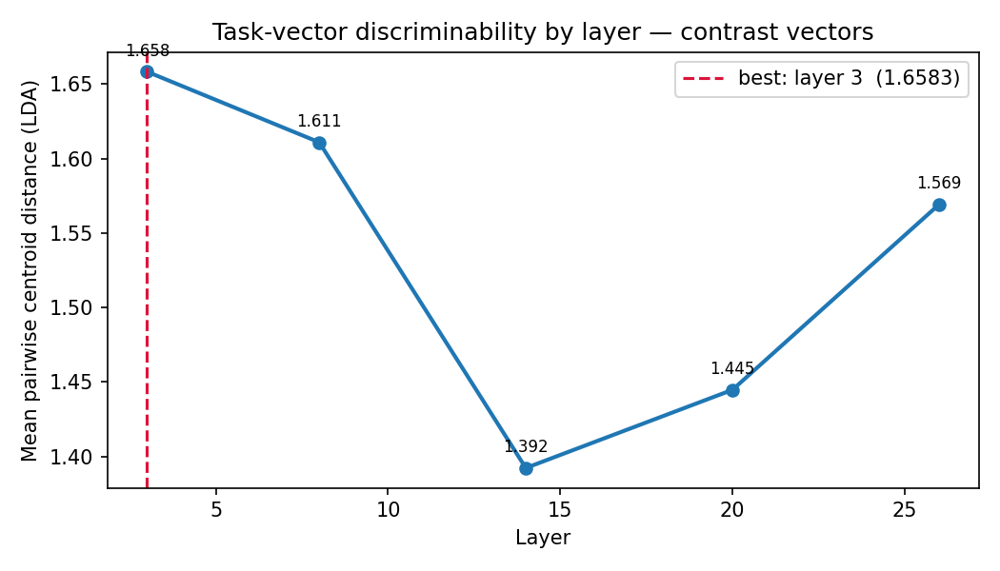
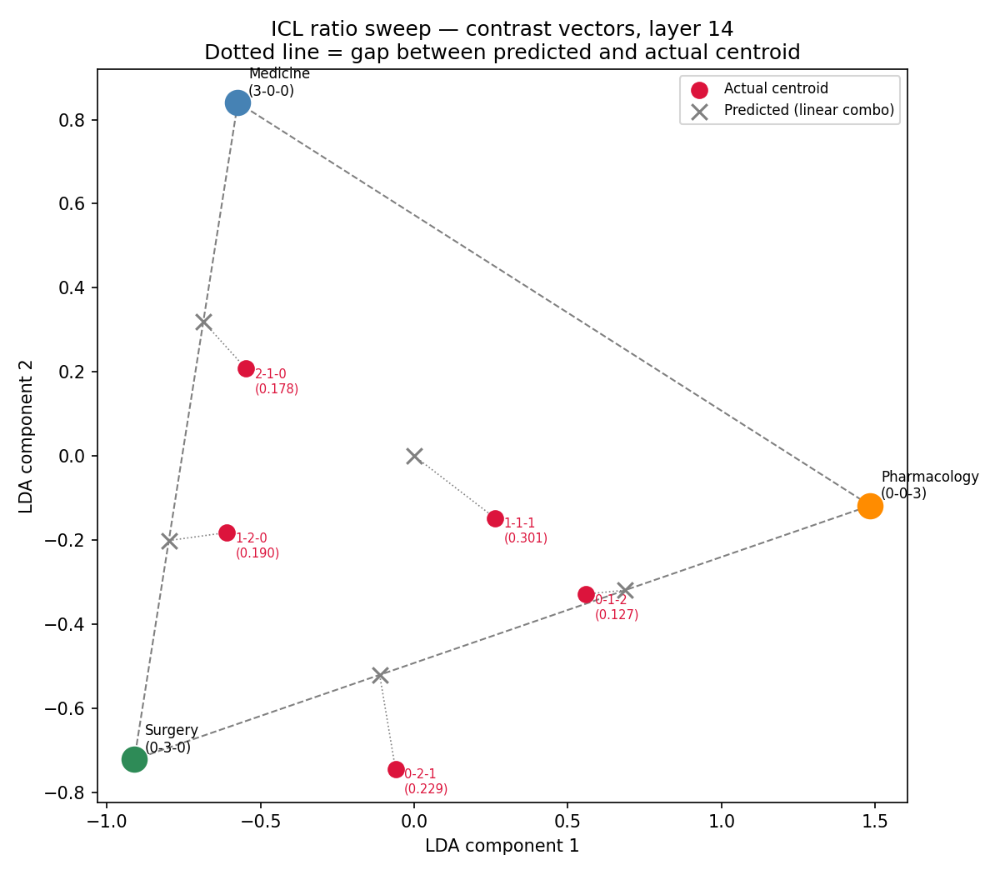
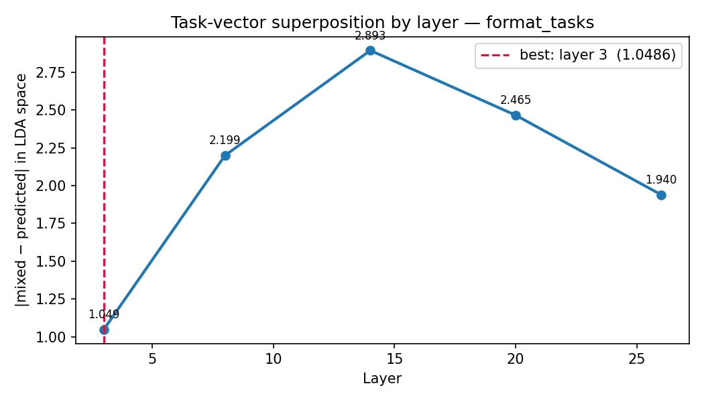
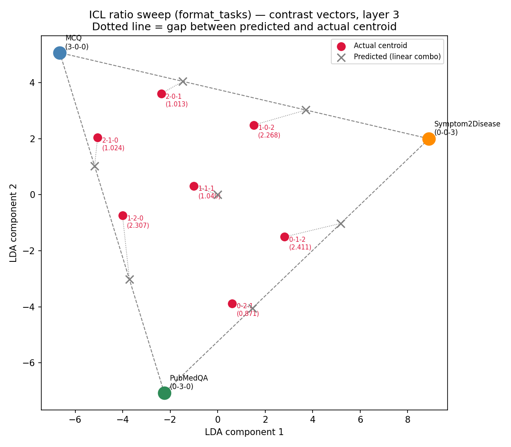
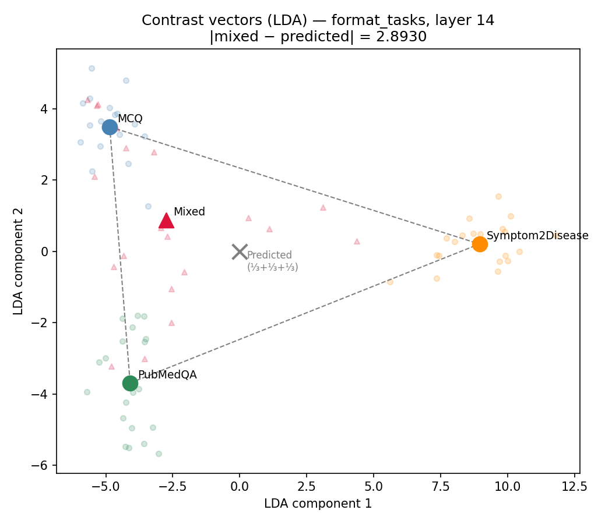

# Task Vector Superposition in LLMs

Experiments testing whether in-context learning (ICL) examples cause a language model's residual stream to encode task identity, and whether mixed-task ICL prompts produce **representational superposition** — internal states that are linear combinations of the individual task vectors.

Inspired by [Everything Everywhere All at Once (Hendel et al., 2023)](https://arxiv.org/abs/2410.05603). All experiments use **Llama-3.2-3B-Instruct** on MPS.

**Contrast vectors** are used throughout the ratio and layer sweeps:

```
contrast(ICL) = activation(ICL + test_q) − activation(test_q alone)
```

Subtracting the zero-shot baseline removes the test question's independent contribution, leaving only the shift caused by the ICL context.

---

## Experiment 1 — Medical Specialisation (same output format)

Three medical specialties from [MedMCQA](https://huggingface.co/datasets/openlifescienceai/medmcqa), all sharing the same A/B/C/D output format:

| Task | Domain | Output |
|---|---|---|
| Medicine | Internal medicine, cardiology, endocrinology | Letter (A/B/C/D) |
| Surgery | Operative techniques, indications, outcomes | Letter (A/B/C/D) |
| Pharmacology | Drug mechanisms, kinetics, toxicology | Letter (A/B/C/D) |

### Prompt examples

**Pure Medicine (3-shot):**
```
User:  Question: Which of the following is NOT a feature of nephrotic syndrome?
       A) Hypoalbuminaemia  B) Hypertension  C) Oedema  D) Hyperlipidaemia
       Answer:
Asst:  B

User:  Question: Commonest cause of chronic renal failure in India is?
       A) Hypertension  B) Diabetes mellitus  C) Glomerulonephritis  D) Pyelonephritis
       Answer:
Asst:  C

User:  Question: Ejection fraction is calculated by?
       A) EDV/ESV  B) SV/EDV  C) SV/ESV  D) CO/EDV
       Answer:
Asst:  B

User:  Question: [held-out test question]
       Answer:
```

**Mixed (1 Medicine + 1 Surgery + 1 Pharmacology, shuffled):**
```
User:  Question: Mechanism of action of Metformin? [Pharmacology]
       A) Increases insulin secretion  B) Inhibits hepatic gluconeogenesis
       C) Increases peripheral glucose uptake  D) Inhibits glucose absorption
       Answer:
Asst:  B

User:  Question: Which nerve is most commonly injured in a mid-shaft humerus fracture? [Surgery]
       A) Ulnar  B) Median  C) Radial  D) Musculocutaneous
       Answer:
Asst:  C

User:  Question: Trousseau's sign is seen in? [Medicine]
       A) Hypercalcaemia  B) Hypocalcaemia  C) Hypernatraemia  D) Hyponatraemia
       Answer:
Asst:  B

User:  Question: [held-out test question]
       Answer:
```

### Layer sweep

The layer sweep tests how well the mixed contrast vector centroid tracks the ⅓+⅓+⅓ predicted position across transformer layers.



**Layer 14** shows the best superposition signal for the specialisation experiment. This is consistent with middle layers encoding semantic/domain-level task representations, which is where content about medical specialty would be expected to crystallise.

### Ratio sweep (layer 14)

Each ratio `(n_med, n_sur, n_phar)` sums to 3 ICL examples. The predicted centroid is the weighted average of the three pure-task centroids. Dotted lines show the gap between predicted and actual.



**Key finding:** The actual centroids track the predicted positions closely as ratios shift — increasing the proportion of Surgery examples pulls the contrast vector toward the Surgery anchor, and so on. This confirms **linear superposition**: the mixed contrast vector is approximately a weighted combination of the pure single-task vectors, with weights proportional to the number of ICL examples from each task.

---

## Experiment 2 — Format-Distinct Tasks (different output formats)

Three tasks with the same clinical input style but structurally different output formats, sourced from three separate datasets:

| Task | Dataset | Output |
|---|---|---|
| MCQ | [MedMCQA](https://huggingface.co/datasets/openlifescienceai/medmcqa) (Medicine split) | Letter (A/B/C/D) |
| PubMedQA | [PubMedQA pqa_labeled](https://huggingface.co/datasets/qiaojin/PubMedQA) | Word (yes/no/maybe) |
| Symptom2Disease | [gretelai/symptom_to_diagnosis](https://huggingface.co/datasets/gretelai/symptom_to_diagnosis) | Number index (1–22) |

Format differences make the ICL examples structurally incompatible — a key requirement for observing behavioural superposition. Tasks with identical output formats (like Experiment 1) can only show *representational* superposition, not behavioural mixing.

### Prompt examples

**Pure MCQ (3-shot):**
```
User:  Question: Which enzyme is deficient in Phenylketonuria?
       A) Phenylalanine hydroxylase  B) Tyrosinase  C) Homogentisate oxidase  D) Fumarylacetoacetase
       Answer:
Asst:  A

User:  Question: [2 more MCQ examples]
       Answer:
Asst:  [letter]

User:  Question: [held-out test question]
       Answer:
```

**Pure PubMedQA (3-shot):**
```
User:  Question: Does aerobic exercise improve glycaemic control in type 2 diabetes?
       Options: Yes / No / Maybe
       Answer:
Asst:  yes

User:  Question: [2 more PubMedQA examples]
       Options: Yes / No / Maybe
       Answer:
Asst:  [yes/no/maybe]

User:  Question: [held-out test question]
       Answer:
```

**Pure Symptom2Disease (3-shot):**
```
User:  Question: Patient presents with itchy, watery eyes, sneezing, and nasal congestion
                 triggered by seasonal pollen exposure.
       1) allergy  2) arthritis  3) bronchial asthma  ...  22) varicose veins
       Answer:
Asst:  1

User:  Question: [2 more S2D examples with numbered disease list]
       Answer:
Asst:  [index]

User:  Question: [held-out test question — no options shown]
       Answer:
```

**Mixed (1 MCQ + 1 PubMedQA + 1 Symptom2Disease, shuffled):**
```
User:  Question: Does regular aspirin use reduce colorectal cancer incidence?  [PubMedQA]
       Options: Yes / No / Maybe
       Answer:
Asst:  yes

User:  Question: Patient reports joint pain, morning stiffness, and swan-neck deformity.  [S2D]
       1) allergy  2) arthritis  ...  22) varicose veins
       Answer:
Asst:  2

User:  Question: First-line treatment for H. pylori infection?  [MCQ]
       A) Amoxicillin alone  B) Triple therapy  C) Metronidazole alone  D) PPI alone
       Answer:
Asst:  B

User:  Question: [held-out test question — format rotated across samples]
       Answer:
```

> **Note on test question rotation:** For mixed conditions the test question type is rotated across all three formats (MCQ → PubMedQA → S2D → ...) across samples. This averages out the format-interaction effect at the assistant-header hook position: the last token's query vector attends back through the ICL context differently depending on the test question's format, which would otherwise bias the contrast vector even after the zero-shot subtraction.

### Layer sweep



**Layer 3** is optimal for the format-distinct task experiment — the opposite of Experiment 1. This reflects a known property of transformer architectures: early layers encode structural and syntactic patterns (output format tokens, prompt templates), while middle layers encode semantic content (domain knowledge, specialty). Format differences between tasks are resolved at the token-structure level before deep semantic processing begins.

| Experiment | Optimal layer | Why |
|---|---|---|
| Specialisation (same format) | 14 | Semantic/domain task identity lives in middle layers |
| Format-distinct tasks | 3 | Structural/format task identity lives in early layers |

### Ratio sweep (layer 3)



**Key finding:** At layer 3, the actual centroids track predicted positions inside the triangle for all ratios. The 1-1-1 equal mix falls very close to the ⅓+⅓+⅓ predicted centroid (gap = 1.05), confirming superposition. Ratios mixing PubMedQA and Symptom2Disease show slightly larger gaps (≈2.3–2.4) than MCQ-dominant ratios (≈1.0), likely because the yes/no and number-index formats share some early-layer structural overlap.

Compare with the same sweep run at layer 14 (the worst layer for this experiment):



At layer 14, all actual centroids cluster near MCQ/PubMedQA regardless of ratio, and Symptom2Disease examples contribute almost no signal (gaps of 5–6 LDA units). Format identity has already been processed and is no longer meaningfully separable at that depth.

---

## Project structure

```
.                               # shared scripts and data loaders
├── sweep_icl_ratios.py         # ratio sweep (--experiment specialization | format_tasks)
├── sweep_layers.py             # layer sweep (--experiment specialization | format_tasks)
├── data_specialization.py      # data loader — MedMCQA specialties
├── data_format_tasks.py        # data loader — MCQ / PubMedQA / Symptom2Disease
├── local_model.py              # model loading, get_activation, predict_mcq, etc.
├── log_utils.py                # ICL sample logging
├── specialization/             # specialty-experiment scripts and plots
│   ├── analyze_specializations.py
│   ├── compare_accuracies.py
│   └── sweep_system_prompt.py
├── format_tasks/               # format-task-experiment scripts and plots
│   ├── analyze_format_tasks.py
│   └── sweep_format_ratios.py
└── multi_agent_diagnosis/      # separate multi-agent diagnostic system
    ├── ai_doctor_agent.py
    ├── main.py
    └── tools.py
```

## Usage

```bash
# Specialisation experiment
python sweep_layers.py                                    # layer sweep
python sweep_icl_ratios.py                                # ratio sweep at layer 14

# Format-distinct tasks experiment
python sweep_layers.py --experiment format_tasks          # layer sweep
python sweep_icl_ratios.py --experiment format_tasks      # ratio sweep at layer 3
python format_tasks/sweep_format_ratios.py                # convenience wrapper
```
