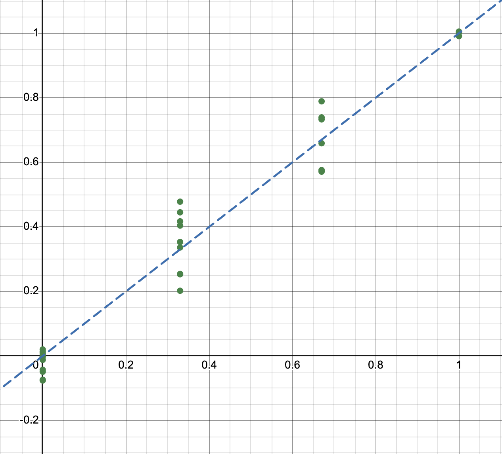
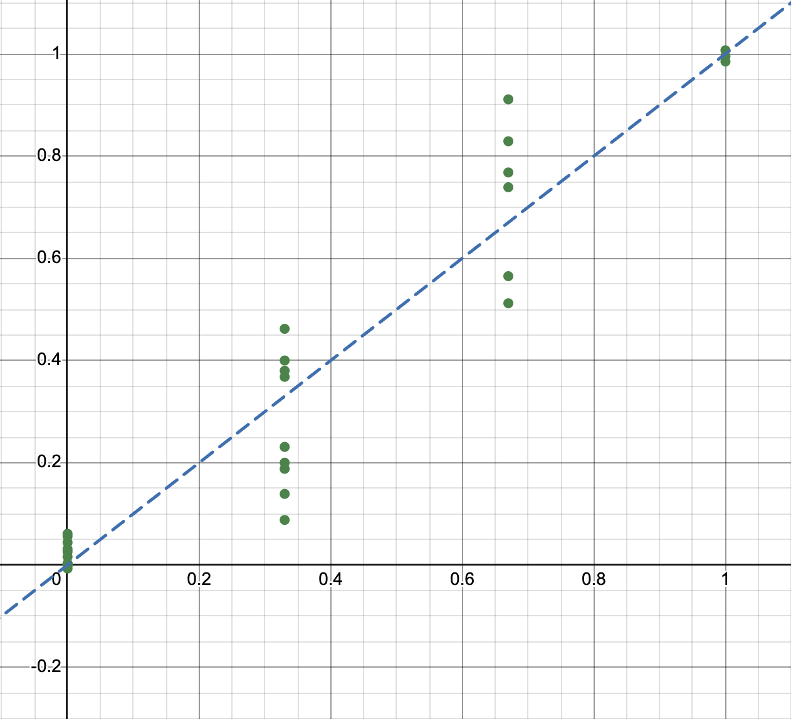
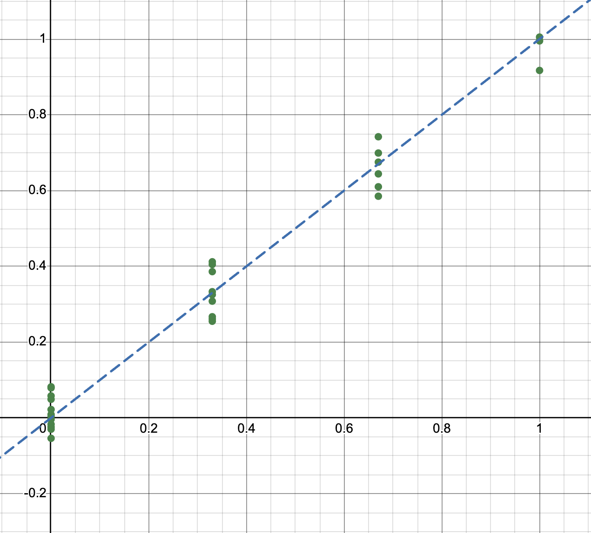
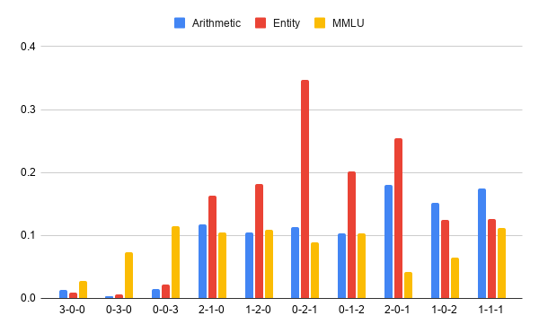

# Empirical Verification of Linear Task Superposition in LLMs

An empirical study of whether In-Context Learning (ICL) examples induce **linearly superposed task representations** in transformer residual streams, whether that linearity is quantifiable and statistically significant, and **how uniformly it holds across network depth**.

When in-context examples span multiple tasks, LLMs represent and perform all of them at once — *task superposition*. Prior work posits that this superposition is a **convex combination** of individual task vectors, but this had not been directly verified at the activation level in instruction-tuned models, nor had its **uniformity across depth** been examined. We study it three ways:

1. **Geometry (κ).** Mixed-task contrast-vector centroids land on the ratio-weighted convex combination of the pure-task centroids (κ ≈ 1), calibrated against an **exact permutation null** — significant at the floor *p* = 1/720 for every model, task group, and layer. But κ is a *scalar* projection: scale-accurate, yet near-constant across depth, so it cannot reveal how the geometry changes layer to layer.
2. **The orthogonal residual (central analysis).** κ is blind to the component *orthogonal* to the predicted convex direction. Calibrated against a **split-half sampling-noise floor**, this residual's *magnitude* grows with depth, while its *resolvability* above the floor peaks in the **middle layers** — locating where linear superposition is geometrically tight and where it begins to strain. Whether a resolvable orthogonal component emerges at all is governed by **task separability**, not depth alone, yielding three regimes: *residual-driven*, *floor-driven*, and *floor-limited*.
3. **Recoverability (OLS).** The true mixture ratio of a mixed-task prompt is recoverable from the pure-task centroids via reparameterized OLS, with no prior knowledge of the task distribution — confirming the linear structure is precise enough to decode.

Inspired by [*Everything Everywhere All at Once* (Xiong et al., 2024)](https://arxiv.org/abs/2410.05603), which established task superposition **behaviorally** in pretrained models. Behavioral superposition is a claim about *outputs* and does not by itself entail that the underlying representations **combine linearly**; we test the representations directly.

**Models (three families, 1B–8B):** Llama-3.2-1B, Llama-3.2-3B, Llama-3.1-8B, Gemma-2-2B, Qwen-2.5-3B (instruction-tuned variants).

---

## Core methodology

**Task vectors** are the raw activations of the assistant header in the residual stream.
**Contrast vectors** isolate the ICL signal by subtracting the zero-shot baseline:

```
contrast(ICL) = activation(ICL + test_q) − activation(test_q alone)
```

This removes the test question's independent contribution, leaving only the shift caused by the ICL context. The zero-shot activation is precomputed once per sample and reused across all ratios.

**κ (linear superposition fidelity)** quantifies how closely the actual mixed centroid tracks the ratio-weighted linear combination of pure-task centroids. For a given in-context task ratio:
* `predicted` = the ratio-weighted average of the pure-task centroids
* `actual` = the true centroid of the samples at that in-context ratio
* `center` = the arithmetic mean of the pure-task centroids

```
κ = dot(actual − center, predicted − center) / ‖predicted − center‖²
```

κ = 1 means perfect linear combination; κ = 0 means orthogonal (no linear tracking); κ is signed and unbounded by design, so it *could* be negative or ≫ 1. κ is undefined for the equal 1-1-1 ratio (predicted = center, denominator = 0) and excluded there. All κ is computed in the **original activation space**, not the LDA projection used for the scatter plots.

**Exact permutation null.** κ ≈ 1 could in principle be an artifact of the metric's scale, so we calibrate it. For the *K* = 6 mixed ratios with a well-defined predicted displacement (the three pure ratios form the basis; 1-1-1 is excluded), we re-pair each observed displacement with a permuted prediction and score the mean κ. With 6! = 720 relabelings we enumerate the null **exactly**; the observed pairing beating all others gives the floor *p* = 1/720 ≈ 1.4 × 10⁻³. See [`experiments/kappa_null.py`](experiments/kappa_null.py).

**Orthogonal residual + split-half noise floor.** κ pins only the component of the observed displacement *along* the predicted convex direction; it is blind to any *orthogonal* deviation. We measure that residual directly as the sine of the angle between the observed and predicted displacements, `sinθ(d, d̂)`. In finite samples this can never reach 0 (the centroid carries sampling noise), so comparing it to 0 is uninformative. Instead we calibrate it against a **split-half sampling-noise floor** φ: repeatedly split a ratio's samples in half, form a displacement from each half, and take the angle between them (holding the pure-task basis at its full-sample value, 500 splits). φ is the best agreement the data can resolve — no prediction should align with `d` more closely than an independent estimate of `d` aligns with itself.

* The **magnitude** of the residual is reported with the full-sample `sinθ` (minimum-variance, so it tracks the trend across depth without being flattened by noise).
* **Resolvability** is tested with a *size-matched* residual on the same *n*/2 half-samples as the floor, so the comparison is fair. The **resolvability ratio** `R = s̃/φ` has `R = 1` as the floor: `R > 1` marks a statistically resolvable orthogonal component; `R ≤ 1` means the mixed centroid is indistinguishable from the exact convex-predicted point given sampling noise. See [`experiments/aggregate_split_half.py`](experiments/aggregate_split_half.py) and [`experiments/bootstrap_ci.py`](experiments/bootstrap_ci.py).

---

## Task groups

Three groups probe superposition under different kinds of task difference.

| Group | Tasks | Shared surface form | Tests separability of… |
|---|---|---|---|
| **Arithmetic** | Direct (`42`) · MCQ (`B`) · Verification (`True`) | same arithmetic inputs, different output *format* | **format** structure (early-layer signal) |
| **Entity** | Capital (`France→Paris`) · Currency (`France→Euro`) · Language (`France→French`) | a bare country name; no scaffolding | **semantic relation** under an underspecified prompt |
| **MMLU** | History · Law · ML | identical A/B/C/D format | **semantic domain** only (hardest case) |

In-context ratios sweep the 10 points of the 3-task simplex summing to 3: three pures (3-0-0, 0-3-0, 0-0-3), six 2-1-0 mixes, and the equal 1-1-1.

---

## Result 1 — Geometry: κ ≈ 1 everywhere, rejected against the exact null

**Mean κ across all mixed ratios and swept layers** (— = not run; Llama-8B/MMLU omitted for hardware):

| Model | Arithmetic | Entity | MMLU |
|---|---|---|---|
| Llama-3.2-1B | 1.051 | 0.983 | 0.977 |
| Llama-3.2-3B | 0.994 | 1.016 | 1.006 |
| Llama-3.1-8B | 0.997 | 0.930 | — |
| Gemma-2-2B | 1.014 | 1.038 | 0.980 |
| Qwen-2.5-3B | 1.051 | 1.033 | 0.964 |

**In every cell above, at every one of the 8 swept layers, the observed mean κ exceeds all 720 permutations** → floor *p* = 1/720 ≈ 1.4 × 10⁻³, against a null centered near 0. The convex-combination hypothesis is rejected in favor of genuine linear superposition across all models and task groups.

### Cross-model κ vs. relative layer depth

Mean κ ± 1 std across mixed ratios at each relative depth; grey band = κ ∈ [0.75, 1.25].

| Arithmetic | Entity | MMLU |
|---|---|---|
|  |  |  |

Format-varying **Arithmetic** shows the largest κ-variance growth with depth; semantic **MMLU** holds κ ≈ 1 nearly flat. Qwen and Gemma replicate the Llama pattern despite different architectures, training data, and tokenizers — supporting cross-family generalizability.

The **mean** κ, however, stays near unity at every depth in every cell. As a scalar projection it is scale-accurate but *flat across depth* — it establishes that linear superposition captures the dominant structure, but not how the geometry changes layer to layer. That question is carried entirely by the component κ ignores: the **orthogonal residual**, analyzed next.

### Layer-sweep projections (LDA, 8 relative depths)

Large dots = pure-task centroids, small dots = samples, × = ratio-predicted centroid, dotted line = predicted→actual gap, κ annotated per mixed ratio.

**Arithmetic**

| Llama-1B | Llama-3B | Llama-8B | Gemma-2B | Qwen-3B |
|---|---|---|---|---|
|  |  |  |  |  |

**Entity**

| Llama-1B | Llama-3B | Llama-8B | Gemma-2B | Qwen-3B |
|---|---|---|---|---|
|  |  |  |  |  |

**MMLU**

| Llama-1B | Llama-3B | Gemma-2B | Qwen-3B |
|---|---|---|---|
|  |  |  |  |

---

## Result 2 — The orthogonal residual: where linearity strains, and why

κ confirms the mixed centroid lies *along* the predicted convex direction, but a centroid can project with unit coefficient and still sit *off* the predicted point. We measure that orthogonal residual `sinθ(d, d̂)` directly and calibrate it against the split-half sampling-noise floor φ (see *Core methodology*). **This is the paper's central analysis.**

**Two findings.**
1. The residual's **magnitude** is smallest in the early layers (sinθ ≈ 0.30–0.49, at or below the floor) and substantially larger by the deepest layers (≈ 0.55–0.83) — linear superposition is geometrically **tightest early**.
2. Whether the deeper residual is *statistically resolvable* above the floor is governed by **task separability, not depth alone**: for well-separated groups the pure-task displacements sharpen with depth, shrinking φ until the residual clears it; for entangled MMLU (three subjects sharing one A/B/C/D format) the floor stays high, so resolvability only *approaches* the floor with depth — clearing it marginally and only at the deepest layers in the two best-separated models (Gemma-2B, Qwen-3B; R ≈ 1.05–1.09), while two of the five models stay at or below it throughout.

This is about *resolving power*, not a breakdown of linearity — κ stays ≈ 1 in every case, and the convex combination remains the dominant, decodable structure at all depths.

### Residual magnitude and resolvability vs. depth

Left: full-sample residual magnitude (solid) vs. its split-half floor (dashed), per model. Right: resolvability ratio `R = s̃/φ` aggregated across models per group; dashed line = floor (R = 1), above which the orthogonal component is resolvable.

| Residual magnitude (+ noise floor) | Resolvability `R = s̃/φ` |
|---|---|
|  |  |

The residual's magnitude grows with depth **everywhere**, but its resolvability does **not**: it peaks in the **middle layers** for the well-separated groups and decays back toward the floor by the deepest layers, while MMLU only *approaches* the floor with depth — clearing it marginally at the deepest layers in two models (Gemma-2B, Qwen-3B; R ≈ 1.05–1.09) and staying at or below it throughout in the others.

### One mechanism, three regimes

Resolvability `R = s̃/φ` has **two levers**: it rises when the orthogonal residual *grows* (numerator up) and when task separability *sharpens*, shrinking the floor (denominator down). Decomposing the ascending run of `R` up to its peak — per-model least-squares slopes of the residual and the floor vs. relative depth, averaged across the five models:

| Group | Mean peak depth | Residual ROC | Floor ROC | Regime |
|---|---|---|---|---|
| **Arithmetic** | 0.38 | **+1.0** | 0.0 | **Residual-driven** — an emerging orthogonal component rises into a near-static floor |
| **Entity** | 0.56 | +0.2 | **−1.3** | **Floor-driven** — a collapsing floor exposes an almost-flat residual as separation sharpens |
| **MMLU** | 0.73 | +0.5 | +0.2 | **Floor-limited** — residual grows as elsewhere, but the floor never falls, so R never forms a mid-network peak; it clears the floor only marginally at the deepest layers (Gemma-2B, Qwen-3B; R ≈ 1.05–1.09), staying at or below it throughout in two of five models |

(ROC = rate of change per unit relative depth.) A resolvable orthogonal component thus emerges only where a **rising residual meets a falling floor** — a mid-depth phenomenon for separable geometries, and one that surfaces at most marginally — only at the deepest layers, and only in some models — for entangled ones, even though all three groups preserve their first-order linear structure equally well (κ ≈ 1).

---

## Result 3 — Recoverability: inferring the mixture ratio via OLS

If task vectors superpose linearly, the map ICL ratio → contrast vector is invertible: given a contrast vector from an unknown prompt, recover the mixing coefficients α. For a probe `x` and pure-task centroids `c₁, c₂, c₃`, solve

```
x ≈ α₁·c₁ + α₂·c₂ + α₃·c₃    subject to  α₁ + α₂ + α₃ = 1
```

via **reparameterized OLS** (eliminate one variable to enforce sum-to-1 exactly, *without* imposing non-negativity — so non-negativity of the recovered α is a *testable outcome*, not a baked-in constraint):

```
x − c₃ ≈ α₁·(c₁ − c₃) + α₂·(c₂ − c₃);   α₃ = 1 − α₁ − α₂
```

The decomposition layer is chosen **only from the three pure ratios** (lowest reconstruction error); mixed ratios are held out for evaluation. Recovered coefficients (Llama-3.2-3B) plotted against ground truth — points on the identity line = exact recovery:

| Arithmetic (layer 3) | Entity (layer 18) | MMLU (layer 18) |
|---|---|---|
|  |  |  |

**Per-ratio L2 error across task groups:**



Recovery is strong across all groups; MMLU is the most accurate and uniform, while Entity shows larger deviations on mixed ratios (semantic heterogeneity under a bare-country prompt mixes less cleanly than shared-format tasks). A noise-centroid permutation baseline confirms recovery is driven by task-specific geometry, not the shared component. Full per-ratio coefficient tables with 95% bootstrap CIs are in the paper appendix.

---

## Project structure

```
.
├── local_model.py                  # model loading; set TASK_VECTOR_MODEL / TASK_VECTOR_QUANTIZE env vars
├── requirements.txt
├── data/
│   ├── data_arithmetic_formats.py      # Direct / MCQ / Verification pools
│   ├── data_entity_attribute.py        # Capital / Currency / Language (country-attribute) pools
│   └── data_semantic_domains.py        # History / Law / ML MMLU pools
├── experiments/
│   ├── sweep_arithmetic.py             # ratio + layer sweep, arithmetic (κ + split-half + permutation null)
│   ├── sweep_entity.py                 # ratio + layer sweep, entity attribution
│   ├── sweep_mmlu.py                   # ratio + layer sweep, MMLU semantic domains
│   ├── kappa_null.py                   # exact 720-permutation null for κ
│   ├── plot_kappa_comparison.py        # cross-model κ comparison plots
│   ├── aggregate_split_half.py         # orthogonal residual + split-half noise floor (magnitude, resolvability)
│   ├── bootstrap_ci.py                 # bootstrap CIs for the resolvability ratio R
│   ├── plot_residual_depth.py          # residual magnitude vs. depth (+ floor), per group
│   ├── plot_residual_ratio_depth.py    # resolvability R = s̃/φ vs. depth, aggregated across models
│   └── task_vector_injection/
│       ├── extract_arithmetic.py           # pure-task contrast-vector extraction, arithmetic
│       ├── extract_entity.py               # pure-task contrast-vector extraction, entity
│       ├── extract_vectors.py              # pure-task contrast-vector extraction, MMLU
│       └── decompose_task_mixture.py       # inverse superposition / mixture recovery (reparameterized OLS)
├── results/                            # output figures + κ JSON (κ, split-half residual/floor, permutation null)
├── ratio_centroids/                    # cached mixed-ratio centroids (for downstream metrics)
└── archive/                            # earlier exploratory experiments
```

---

## Usage

```bash
# --- κ layer/ratio sweeps (writes results/<group>_kappa_<model>.json + figures) ---
python experiments/sweep_arithmetic.py                                             # default Llama-3.2-3B, fp16
python experiments/sweep_arithmetic.py --model meta-llama/Llama-3.2-1B-Instruct
python experiments/sweep_arithmetic.py --model meta-llama/Llama-3.1-8B-Instruct --quantize int8
python experiments/sweep_entity.py     --model google/gemma-2-2b-it
python experiments/sweep_mmlu.py       --model Qwen/Qwen2.5-3B-Instruct

# --- cross-model κ comparison plots (reads results/) ---
python experiments/plot_kappa_comparison.py                          # → arithmetic_kappa_comparison_across_models.png
python experiments/plot_kappa_comparison.py --glob "entity_kappa_*.json"
python experiments/plot_kappa_comparison.py --glob "mmlu_kappa_*.json"

# --- orthogonal residual + split-half noise floor (reads results/*_kappa_*.json) ---
python experiments/aggregate_split_half.py --grid                    # residual/floor summary table (per layer)
python experiments/bootstrap_ci.py                                   # bootstrap CIs for resolvability R = s̃/φ
python experiments/plot_residual_depth.py                            # → results/orthogonal_residual_depth.png
python experiments/plot_residual_ratio_depth.py --per-model          # → results/orthogonal_residual_ratio_depth_by_model.png

# --- OLS mixture recovery ---
python experiments/task_vector_injection/decompose_task_mixture.py --select_layer          # find best layer on pure ratios
python experiments/task_vector_injection/decompose_task_mixture.py --layer 3 --sweep --ci   # all 10 ratios + bootstrap CIs
python experiments/task_vector_injection/decompose_task_mixture.py --experiment mmlu --layer 18 --sweep --noise
```

Set the model with `--model` or the `TASK_VECTOR_MODEL` environment variable. Outputs (PNG figures and κ JSON) are written to `results/`.

---

## Background

Early exploratory work (archived) tested the same superposition hypothesis on medical-specialty tasks (Medicine / Surgery / Pharmacology from MedMCQA) and format-distinct clinical tasks (MCQ / PubMedQA / Symptom2Disease). Those runs established the initial observation of linear superposition and that optimal layer depth differs by task type (early for format, middle for semantics). The arithmetic, entity, and MMLU experiments here add tighter controls, the quantitative κ framework with an exact null, the depth-resolved orthogonal-residual analysis against a split-half noise floor, and OLS mixture recovery.
