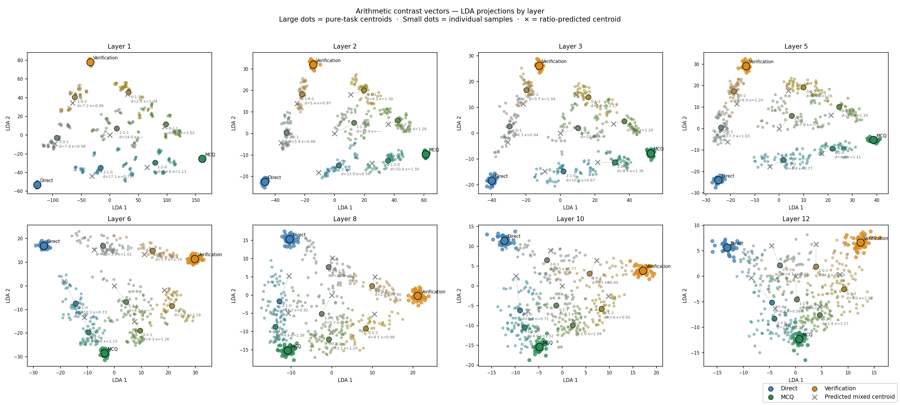
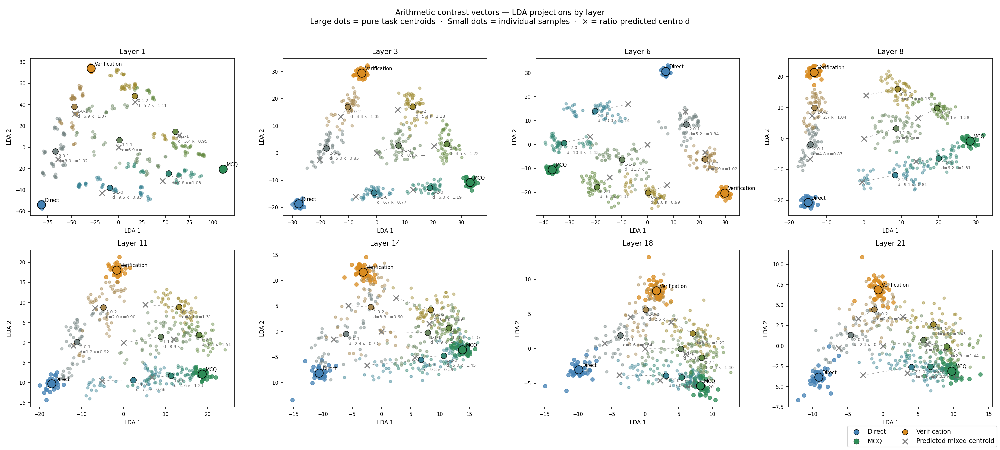
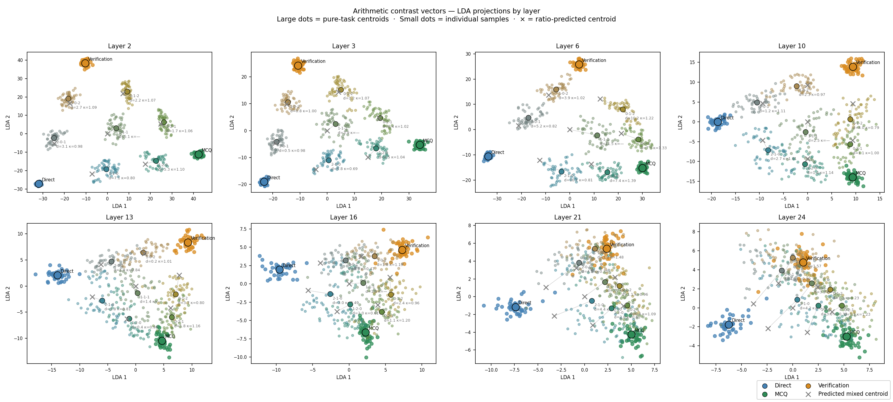
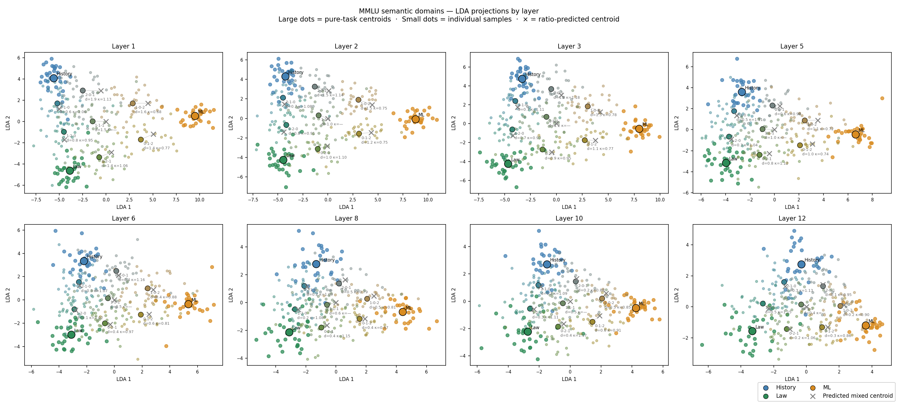
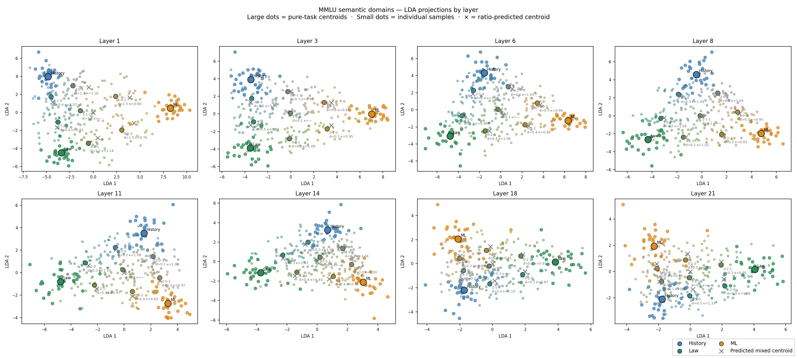

# Task Vector Superposition in LLMs

Empirical study of whether ICL examples induce **linearly superposed task representations** in transformer residual streams, and whether that linearity is quantifiable, robust across task types, and consistent across model scales.

Inspired by [Everything Everywhere All at Once (Xiong et al., 2024)](https://arxiv.org/abs/2410.05603). Extends prior qualitative work with a quantitative metric (κ), a controlled experimental design using contrast vectors, and cross-scale validation across the Llama-3 family (1B / 3B / 8B).

---

## Core methodology

**Contrast vectors** isolate the ICL signal by subtracting the zero-shot baseline:

```
contrast(ICL) = activation(ICL + test_q) − activation(test_q alone)
```

This removes the test question's independent contribution, leaving only the shift caused by the ICL context. The zero-shot activation is precomputed once per sample and reused across all ratios (reduces forward passes by ~45%).

**Test question rotation** applies uniformly to all conditions (pure and mixed), so the test question's format never creates an asymmetric confound between conditions.

**κ (linear superposition fidelity)** quantifies how closely the actual mixed centroid tracks the ratio-weighted linear combination of pure-task centroids:

```
κ = dot(actual − center, predicted − center) / ‖predicted − center‖²
```

κ = 1 means perfect linear combination; κ = 0 means no mixing. Undefined (shown as —) when the predicted position is too close to the triangle center (e.g. equal 1-1-1 ratio), where the denominator is numerically unstable.

---

## Experiment 1 — Arithmetic format tasks

Three structurally distinct output formats applied to the same arithmetic inputs:

| Task | Format | Example output |
|---|---|---|
| Direct | Free-form number | `42` |
| MCQ | Letter choice | `B` |
| Verification | True/False | `True` |

**Why this task group:** Format differences create strong early-layer separability. Any superposition signal is not confounded by shared output structure.

### Layer sweep (8 layers, relative depth fractions)

Layers are chosen as fixed fractions of model depth (0.05, 0.1, 0.2, 0.3, 0.4, 0.5, 0.65, 0.75), so results are directly comparable across model sizes.

| Model | Layer sweep |
|---|---|
| Llama-3.2-1B |  |
| Llama-3.2-3B |  |
| Llama-3.1-8B |  |

Each panel: large dots = pure-task centroids, small dots = individual samples, × = ratio-predicted centroid, dotted line = gap between predicted and actual. κ values annotated per mixed ratio.

---

## Experiment 2 — MMLU semantic domains

Three MMLU subject areas sharing the same A/B/C/D output format:

| Task | Domain |
|---|---|
| History | World history, political history |
| Law | Constitutional law, legal reasoning |
| ML | Machine learning, statistics |

**Why this task group:** Identical output format means any separability reflects semantic domain differences only — a harder test for superposition than format differences.

### Layer sweep (8 layers, relative depth fractions)

| Model | Layer sweep |
|---|---|
| Llama-3.2-1B |  |
| Llama-3.2-3B |  |

**Key finding:** κ ≈ 1 consistently across all layers for both models, with no strong layer-depth trend. This contrasts with arithmetic, where layer-dependent structure is more pronounced — consistent with format identity being encoded earlier (structural signal) and semantic identity being more distributed.

---

## Cross-model κ comparison

**Arithmetic tasks (1B / 3B / 8B):**


**MMLU semantic domains (1B / 3B):**


Mean κ ± 1 std across all mixed ratios at each relative layer depth. Grey zone = κ ∈ [0.75, 1.25]. Arithmetic shows more layer-dependent variation; MMLU holds κ ≈ 1 flat across all layers, consistent with the shared A/B/C/D format dominating the contrast vector signal.

---

## Experiment 3 — Inverse superposition: recovering task mixture from contrast vectors

If task vectors superpose linearly, the mapping from ICL ratio → contrast vector should be invertible: given a contrast vector from an unknown prompt, we can recover the mixing coefficients α that produced it.

### Method

For a probe contrast vector `x` and stored pure-task centroids `c₁, c₂, c₃`, solve:

```
x ≈ α₁·c₁ + α₂·c₂ + α₃·c₃    subject to  α₁ + α₂ + α₃ = 1
```

via reparametrised OLS (eliminates one variable, enforces sum-to-1 exactly without a constrained solver):

```
x − c₃ ≈ α₁·(c₁ − c₃) + α₂·(c₂ − c₃)
α₃ = 1 − α₁ − α₂
```

**Critical requirement:** centroid extraction and probe extraction must use identical `rotate_test` protocol. Without this, the ICL-test interaction term is not removed by the zero-shot subtraction and introduces systematic bias — even though the zero-shot baseline is subtracted.

### Layer selection

The optimal layer for decomposition balances two criteria:

- **Norm balance** — equal centroid norms avoid magnitude-driven bias toward any single task
- **Geometric separability** — centroids must be far enough apart for precise decomposition (low condition number)

The `--select_layer` flag scans all stored layers, runs the three pure conditions at each, and reports norm spread, condition number, and mean L2 error to identify the best layer automatically.

### Results — arithmetic (layer 1)

Pure-task conditions are recovered near-perfectly. Mixed ratios are directionally correct with larger errors in equal-mix conditions.

| Ratio | True weights | Inferred α | L2 error |
|---|---|---|---|
| 3-0-0 | Direct=1.00 | Direct=1.000 | 0.002 |
| 0-3-0 | MCQ=1.00 | MCQ=0.998 | 0.002 |
| 0-0-3 | Verification=1.00 | Verification=1.027 | 0.034 |
| 0-2-1 | MCQ=0.67, Ver=0.33 | MCQ=0.678, Ver=0.321 | 0.016 |
| 0-1-2 | MCQ=0.33, Ver=0.67 | MCQ=0.328, Ver=0.702 | 0.046 |

### Results — MMLU semantic domains (layer 10)

Despite all three domains sharing the same A/B/C/D output format, the decomposition recovers mixture coefficients with low error — including the equal 1-1-1 mix.

| Ratio | True weights | Inferred α | L2 error |
|---|---|---|---|
| 3-0-0 | History=1.00 | History=0.971 | 0.059 |
| 0-3-0 | Law=1.00 | Law=1.019 | 0.061 |
| 0-0-3 | ML=1.00 | ML=0.936 | 0.092 |
| 1-1-1 | all=0.33 | H=0.371, L=0.304, ML=0.325 | 0.049 |
| 2-0-1 | History=0.67, ML=0.33 | H=0.675, ML=0.354 | 0.037 |

MMLU decomposition is notably cleaner than arithmetic for equal-mix conditions, because the shared format means contrast vectors are closer in direction and the mixing geometry is more symmetric.

### Usage

```bash
# Find optimal layer automatically
python experiments/task_vector_injection/decompose_task_mixture.py --select_layer
python experiments/task_vector_injection/decompose_task_mixture.py --experiment mmlu --select_layer

# Sweep all 10 simplex ratios at the best layer
python experiments/task_vector_injection/decompose_task_mixture.py --layer 1 --sweep
python experiments/task_vector_injection/decompose_task_mixture.py --experiment mmlu --layer 10 --sweep

# Probe a specific ratio
python experiments/task_vector_injection/decompose_task_mixture.py --ratio 2 1 0
```

---

## Background

Early exploratory work (archived) tested the same superposition hypothesis on medical specialty tasks (Medicine / Surgery / Pharmacology from MedMCQA) and format-distinct clinical tasks (MCQ / PubMedQA / Symptom2Disease). Those experiments established the initial observation of linear superposition and identified that optimal layer depth differs by task type (early layers for format differences, middle layers for semantic differences). The arithmetic and MMLU experiments were designed with tighter experimental controls and the quantitative κ framework.

---

## Project structure

```
.
├── local_model.py              # model loading; set TASK_VECTOR_MODEL / TASK_VECTOR_QUANTIZE env vars
├── requirements.txt
├── data/
│   ├── data_arithmetic_formats.py   # Direct / MCQ / Verification task pools
│   └── data_semantic_domains.py     # History / Law / ML MMLU pools
├── experiments/
│   ├── sweep_arithmetic.py          # ratio + layer sweep, arithmetic tasks
│   ├── sweep_mmlu.py                # ratio + layer sweep, MMLU semantic domains
│   ├── plot_kappa_comparison.py     # cross-model κ comparison plot
│   └── task_vector_injection/
│       ├── extract_vectors.py           # contrast vector extraction, MMLU
│       ├── extract_arithmetic_vectors.py # contrast vector extraction, arithmetic
│       └── decompose_task_mixture.py    # inverse superposition via reparametrised OLS
├── results/                         # output figures and κ JSON files
└── archive/                         # earlier exploratory experiments
```

---

## Usage

```bash
# Arithmetic experiment — default 3B, float16
python experiments/sweep_arithmetic.py
python experiments/sweep_arithmetic.py --model meta-llama/Llama-3.2-1B-Instruct
python experiments/sweep_arithmetic.py --model meta-llama/Llama-3.1-8B-Instruct --quantize int8

# MMLU experiment
python experiments/sweep_mmlu.py
python experiments/sweep_mmlu.py --model meta-llama/Llama-3.2-1B-Instruct

# Cross-model κ comparison (reads from results/)
# → saves results/arithmetic_kappa_comparison_across_models.png
python experiments/plot_kappa_comparison.py
# → saves results/mmlu_kappa_comparison_across_models.png
python experiments/plot_kappa_comparison.py --glob "mmlu_kappa_*.json"
```

Outputs (PNG figures and κ JSON files) are saved to `results/` automatically.
